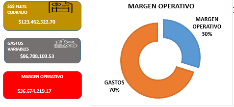
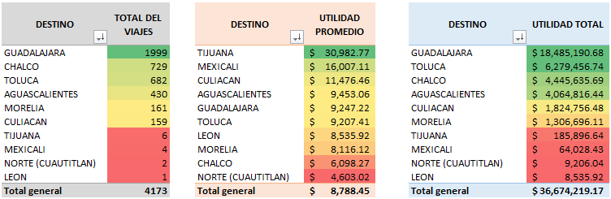
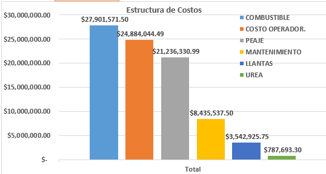
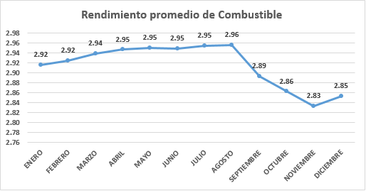

# 🚛 Análisis de KPIs — Transporte de Carga

## 📌 Descripción del proyecto

Este proyecto analiza información de una **operación real de transporte de carga** con el objetivo de transformar registros operativos y financieros en indicadores útiles para la toma de decisiones.

El análisis comprende **4,173 viajes realizados entre enero de 2025 y agosto de 2026** e integra información de rutas, unidades, operadores, kilómetros recorridos, combustible, peajes, mantenimiento, llantas, costos e ingresos.

El objetivo no fue únicamente construir indicadores, sino utilizarlos para identificar patrones, comparar el desempeño de la operación y detectar oportunidades de mejora.

---

## 🎯 Objetivo

Desarrollar un análisis de KPIs que permita:

- Medir el desempeño general de la operación.
- Identificar destinos y rutas con mayor volumen e ingresos.
- Comparar costos y márgenes entre rutas.
- Analizar la estructura de los gastos variables.
- Evaluar utilización y rendimiento de las unidades.
- Analizar el comportamiento del consumo de combustible.
- Explorar diferencias de rendimiento entre operadores.
- Detectar oportunidades para mejorar la eficiencia operativa.

---

## 🔐 Privacidad y anonimización de los datos

Este proyecto utiliza información procedente de una operación real de transporte cuya publicación de las variables analizadas cuenta con autorización.

Para proteger la identidad de las personas y activos involucrados, la versión pública del dataset aplica las siguientes medidas:

- Los nombres de los operadores se sustituyen por identificadores anónimos.
- Los números económicos de las unidades se sustituyen por identificadores anónimos.
- Se eliminan los campos **Carta Porte**, **Número de Contenedor** y **CP Cliente**.
- Las demás variables analíticas se conservan para mantener la utilidad del caso de estudio.

> El archivo público anonimizado se incorporará en la carpeta `data/`.

---

## 📊 Dashboard general



La vista ejecutiva resume los principales indicadores de la operación y permite dimensionar rápidamente el volumen de actividad, los ingresos y la estructura general de los gastos.

### Principales KPIs

| KPI | Resultado |
|---|---:|
| Viajes analizados | **4,173** |
| Viajes entregados | **4,164 (99.78%)** |
| Kilómetros recorridos | **3.37 M km** |
| Ingresos registrados | **$123.46 M MXN** |
| Gastos variables | **$86.79 M MXN** |
| Ganancia según costos incluidos | **$36.67 M MXN** |
| Margen global del modelo | **29.70%** |
| Ingreso promedio por viaje | **$29,586 MXN** |
| Gasto variable promedio por viaje | **$20,798 MXN** |
| Ganancia promedio por viaje | **$8,788 MXN** |
| Distancia promedio por viaje | **809 km** |
| Combustible cargado | **1.16 M litros** |
| Rendimiento global | **2.91 km/L** |
| Unidades utilizadas | **24** |
| Operadores registrados | **33** |

> **Nota:** El margen presentado corresponde a los ingresos y costos incluidos en el modelo de análisis y no representa necesariamente la utilidad neta contable de la empresa.

---

## 🧹 Preparación y calidad de los datos

Antes de calcular los KPIs fue necesario revisar y estandarizar variables categóricas.

Uno de los principales problemas encontrados fue la existencia de diferentes etiquetas para representar un mismo origen.

| Valor original | Valor normalizado |
|---|---|
| MX33 | MX33 |
| MX33-SJI | MX33 |
| MX32 | MX33 |
| MX21 | MX21 |
| MX21-QRO | MX21 |
| mx21 | MX21 |

Después de la normalización se establecieron únicamente **dos orígenes operativos: MX33 y MX21**.

Este proceso evitó generar rutas artificialmente diferentes y demuestra la importancia de validar la calidad de los datos antes de interpretar los resultados.

---

## 🛣️ Análisis por destino y ruta



El análisis por destino permite observar el comportamiento desde tres perspectivas complementarias: **volumen de viajes, utilidad promedio por viaje y utilidad acumulada**.

Un destino con una utilidad promedio elevada no necesariamente genera el mayor impacto económico si cuenta con pocos viajes. Por ejemplo, **Tijuana presenta una utilidad promedio alta, pero únicamente registra 6 viajes**, por lo que el resultado debe interpretarse considerando el tamaño de la muestra.

Después de normalizar los orígenes, las principales rutas fueron:

| Ruta | Viajes | Ingresos | Margen | Costo/km |
|---|---:|---:|---:|---:|
| MX33 → Guadalajara | 1,484 | $46.44 M | 30.03% | $25.23 |
| MX33 → Chalco | 714 | $17.37 M | 25.05% | $31.02 |
| MX33 → Toluca | 681 | $16.44 M | 38.12% | $26.68 |
| MX21 → Guadalajara | 515 | $16.10 M | 28.19% | $24.66 |
| MX33 → Aguascalientes | 424 | $11.73 M | 34.23% | $25.27 |
| MX33 → Culiacán | 159 | $9.96 M | 18.32% | $22.32 |
| MX33 → Morelia | 151 | $3.49 M | 35.28% | $30.92 |

Estas rutas concentran aproximadamente **98.9% de los viajes analizados**.

### Hallazgos principales

**Guadalajara — principal corredor operativo.**  
MX33 → Guadalajara concentra **1,484 viajes**, **$46.44 M MXN de ingresos** y un margen de **30.03%**. Considerando también los viajes procedentes de MX21, Guadalajara alcanza aproximadamente **1,999 viajes**, convirtiéndose en el principal destino de la operación.

**Toluca — combinación de volumen y margen.**  
MX33 → Toluca registra **681 viajes**, **$16.44 M MXN de ingresos** y un margen de **38.12%**, destacando entre las rutas de mayor volumen.

**Chalco — oportunidad de revisión de costos.**  
MX33 → Chalco registra **714 viajes** y un costo variable de aproximadamente **$31.02/km**, superior al de Guadalajara y Toluca.

**Culiacán — relación tarifa–distancia a revisar.**  
Aunque presenta gastos absolutos elevados por viaje debido a la distancia, su costo variable de **$22.32/km** no es el más alto. Su margen de **18.32%** sugiere analizar la relación entre ingreso por kilómetro, distancia y estructura económica del servicio.

---

## 💰 Estructura de costos



Los principales gastos variables acumulados corresponden a:

| Concepto | Gasto |
|---|---:|
| Combustible | **$27.90 M** |
| Costo de operador | **$24.88 M** |
| Peaje | **$21.24 M** |
| Mantenimiento | **$8.44 M** |
| Llantas | **$3.54 M** |
| Urea | **$0.79 M** |

Los tres principales componentes —**combustible, costo de operador y peajes**— concentran aproximadamente **85% de los gastos variables analizados**.

Esto permite priorizar estos conceptos al evaluar oportunidades de eficiencia, en lugar de enfocar el análisis únicamente en partidas de menor participación.

El **costo por kilómetro** se utilizó como indicador complementario porque comparar únicamente el gasto absoluto por viaje puede generar conclusiones engañosas cuando existen diferencias importantes de distancia.

---

## ⛽ Rendimiento de combustible



El rendimiento global de la operación fue de aproximadamente **2.91 km/L**.

El comportamiento mensual muestra valores relativamente estables durante buena parte del periodo visualizado, seguidos por una reducción hacia los últimos meses y una recuperación parcial posterior.

Este comportamiento se considera un **hallazgo para investigación**, no evidencia suficiente para atribuir una causa específica. Para explicar la variación sería necesario incorporar factores como ruta, unidad, operador, carga y condiciones operativas.

---

## 🚚 Análisis de unidades

La operación utiliza **24 unidades**.

Entre las unidades con mayor utilización se identificaron:

| Unidad | Viajes | Km recorridos | Rendimiento |
|---|---:|---:|---:|
| 2477 | 234 | 182,498 | 2.94 km/L |
| 2487 | 222 | 175,384 | 2.92 km/L |
| 2473 | 218 | 174,557 | 2.93 km/L |
| 2476 | 216 | 170,590 | 2.92 km/L |
| 2472 | 210 | 166,192 | 2.95 km/L |

La unidad **2477** registró el mayor volumen de viajes y kilómetros, manteniendo un rendimiento ligeramente superior al promedio global.

Esto muestra que **una mayor utilización no necesariamente implica un menor rendimiento** y que ambos indicadores deben analizarse conjuntamente.

> En el dataset público, los números económicos reales serán sustituidos por identificadores anónimos.

---

## 👷 Análisis de operadores

Se analizaron **33 operadores**.

Se identificaron diferencias en el rendimiento de combustible, pero estas no deben interpretarse de manera aislada. El desempeño puede verse afectado por:

- Ruta asignada.
- Unidad utilizada.
- Distancia recorrida.
- Tipo y configuración de carga.
- Condiciones propias de la operación.

Algunas unidades fueron utilizadas por diferentes operadores, permitiendo observar variaciones de rendimiento sobre un mismo activo.

Sin embargo, atribuir las diferencias exclusivamente al operador requeriría controlar previamente las demás variables. Por esta razón, el proyecto evita presentar un ranking de “mejores” o “peores” operadores únicamente con base en el rendimiento observado.

---

## 💡 Principales insights

1. **La operación presenta una alta concentración por ruta.** Un grupo reducido de corredores concentra la mayor parte de los viajes e ingresos.

2. **Mayor volumen no significa necesariamente mayor margen.** Guadalajara domina por volumen e ingresos, mientras Toluca presenta un margen porcentual superior.

3. **Los costos están altamente concentrados.** Combustible, costo de operador y peajes representan aproximadamente el **85% de los gastos variables**.

4. **El costo absoluto no explica por sí solo el desempeño.** Culiacán presenta gastos elevados por viaje, pero no el mayor costo por kilómetro.

5. **La calidad de los datos modifica las conclusiones.** La normalización de orígenes evitó crear rutas artificialmente diferentes.

6. **Los promedios deben interpretarse junto con el tamaño de la muestra.** Un destino con pocos viajes puede presentar una utilidad promedio elevada sin representar un impacto significativo sobre el resultado global.

7. **Unidad y operador deben analizarse conjuntamente.** Las diferencias de rendimiento requieren considerar también la ruta y las características del viaje.

---

## 🎯 Recomendaciones

1. **Priorizar las rutas de mayor volumen**, debido al impacto potencial que pequeñas mejoras pueden generar sobre el resultado global.

2. **Revisar la estructura tarifa–costo de Culiacán**, especialmente la relación entre ingreso/km y costo/km.

3. **Analizar los componentes de costo de Chalco**, debido a su alto volumen y costo por kilómetro.

4. **Utilizar Toluca como referencia de análisis**, investigando los factores asociados con su combinación de volumen y margen.

5. **Concentrar los esfuerzos de optimización en combustible, operador y peajes**, debido a su participación dentro de los gastos variables.

6. **Monitorear conjuntamente utilización y rendimiento de las unidades**, evitando evaluar eficiencia únicamente por kilómetros o viajes.

7. **Desarrollar indicadores de rendimiento de operadores ajustados por ruta y unidad**, permitiendo comparaciones bajo condiciones operativas similares.

8. **Mantener catálogos y reglas de captura estandarizados** para evitar categorías inconsistentes.

---

## 🛠️ Herramientas utilizadas

- **Microsoft Excel**
- Tablas dinámicas
- Fórmulas y funciones de análisis
- Limpieza y transformación de datos
- Construcción de KPIs
- Análisis de costos
- Visualización de información
- Análisis exploratorio de datos

---

## 📈 Metodología

El proyecto siguió el siguiente flujo:

**Datos → Limpieza → Normalización → KPIs → Destinos y rutas → Costos → Combustible → Unidades → Operadores → Insights → Recomendaciones**

El objetivo fue transformar datos operativos en información útil para apoyar decisiones de negocio.

---

## 📂 Estructura del repositorio

```text
Reporte_KPis_Transporte_de_Carga/
│
├── README.md
│
├── data/
│   └── Reporte_KPIs_Transporte_ANONIMIZADO.xlsx
│
└── images/
    ├── dashboard_general.png
    ├── analisis_destinos.png
    ├── estructura_costos.png
    └── rendimiento_combustible.png
```

> El dataset anonimizado será incorporado en `data/` una vez finalizado el proceso de anonimización y validación.

---

## 🚀 Conclusión

El análisis permitió transformar más de **4,000 registros de viajes** en una visión estructurada del desempeño de una operación de transporte de carga.

Más allá de identificar las rutas con mayor volumen o las unidades con mejor rendimiento, el proyecto demuestra la importancia de relacionar **ingresos, costos, distancia, combustible, unidades, operadores y calidad de los datos**.

Los indicadores aislados pueden producir interpretaciones incompletas. El valor del análisis aparece al relacionar las diferentes variables para comprender qué factores están asociados con el desempeño observado y convertir los datos en información accionable.

---

## 👤 Autor

**Vidal del Ángel**  
Data Analyst

**Excel · SQL · Python · Power BI**

[LinkedIn](https://www.linkedin.com/in/vidal-delangel-dataanalyst) · [GitHub](https://github.com/vidalito2102)
